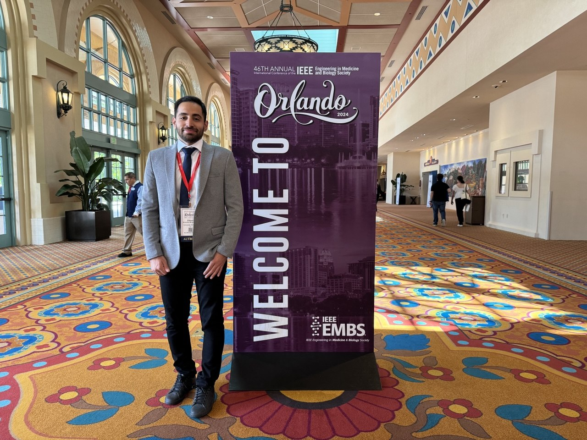
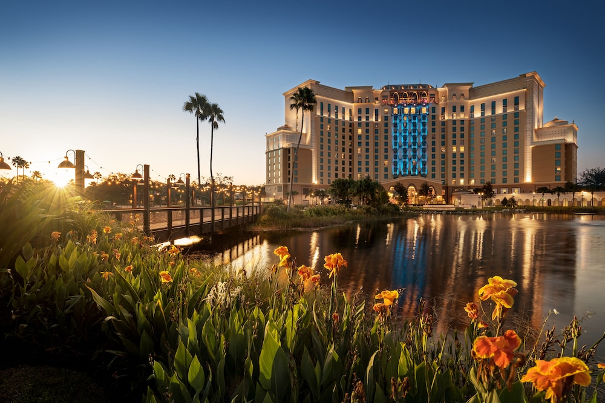
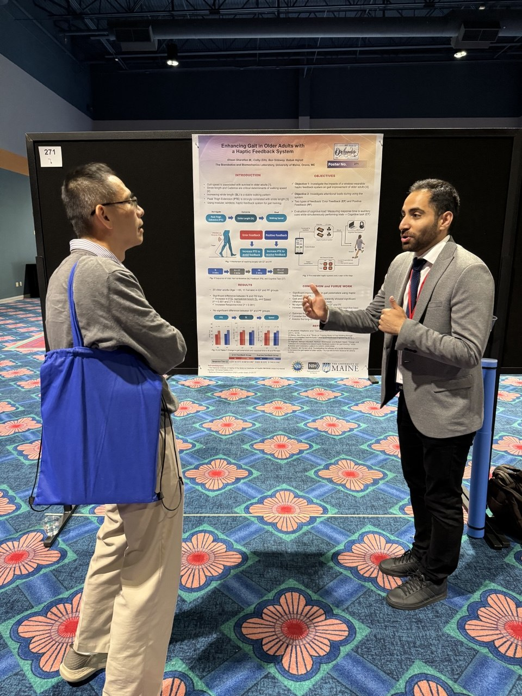
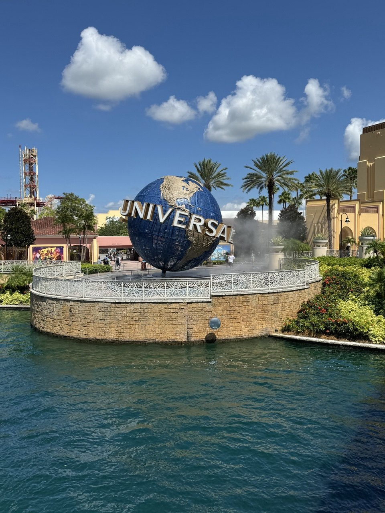
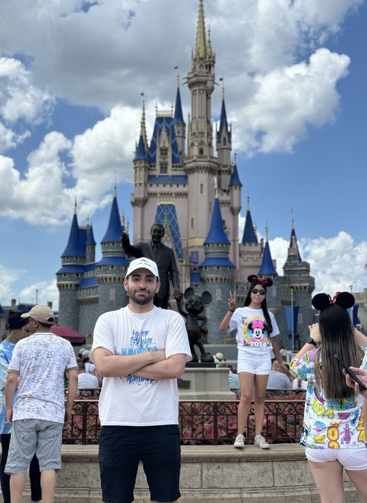
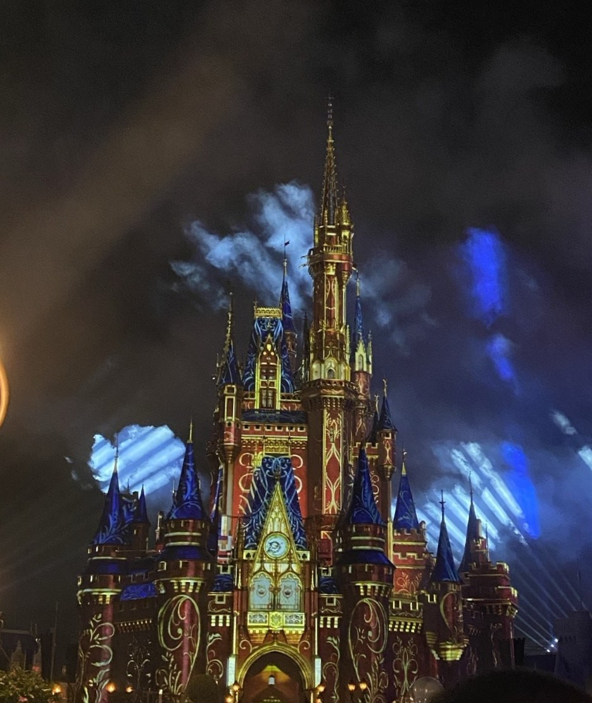

I had the chance to present our research titled **"Enhancing Gait in Older Adults with a Haptic Feedback System"** at the 46th Annual International Conference of the [IEEE Engineering in Medicine and Biology Society](https://embc.embs.org/2024/) (EMBC 2024) in the beautiful city of Orlando, Florida.

EMBC is one of the largest international conferences in biomedical engineering, bringing together researchers, clinicians, and industry professionals from around the world. It was a great experience to exchange ideas with experts in the field and receive valuable feedback on our work in gait rehabilitation for older adults and individuals with walking impairments.

Orlando also offered some memorable moments outside the conference, including visits to Walt Disney World and Universal Studios.

