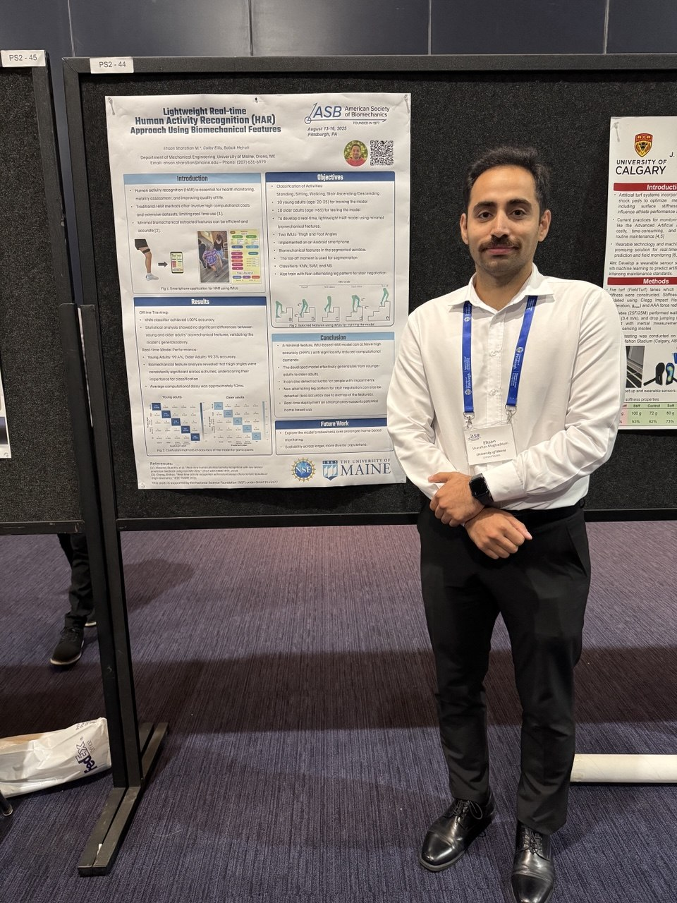
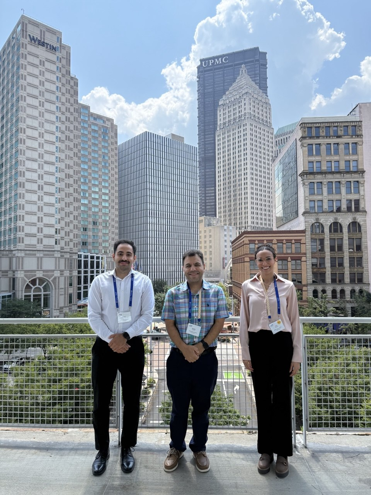
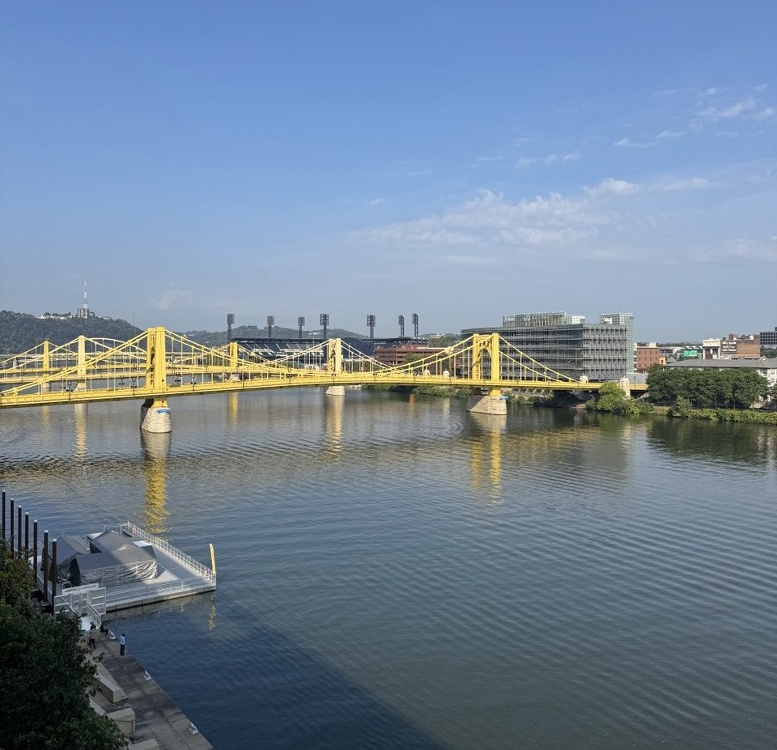

After missing the American Society of Biomechanics conference last year due to a thunderstorm and flight cancellations, it felt incredibly rewarding to finally attend [**American Society of Biomechanics (ASB)**](https://asbweb.org/) in **Pittsburgh, PA**.

I had the opportunity to present our work on a **real-time and lightweight human activity recognition system** using biomechanical features. It was an amazing experience to exchange ideas with experts in the biomechanics community and receive valuable feedback on our research.

The ASB Annual Meeting is one of the premier conferences in the field, bringing together researchers, clinicians, and industry professionals to share the latest advances in biomechanics. This year's meeting featured a wide range of topics from wearable sensing to clinical gait analysis.

Pittsburgh was a wonderful host city, known for its iconic bridges, vibrant riverfront, and thriving research community.

