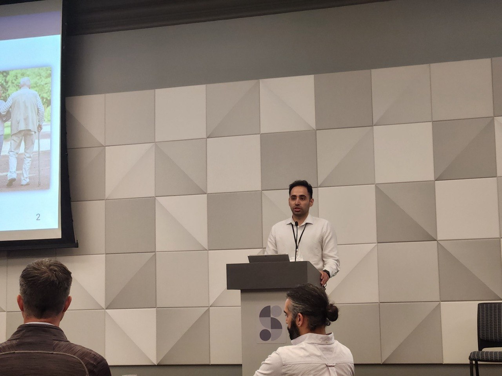
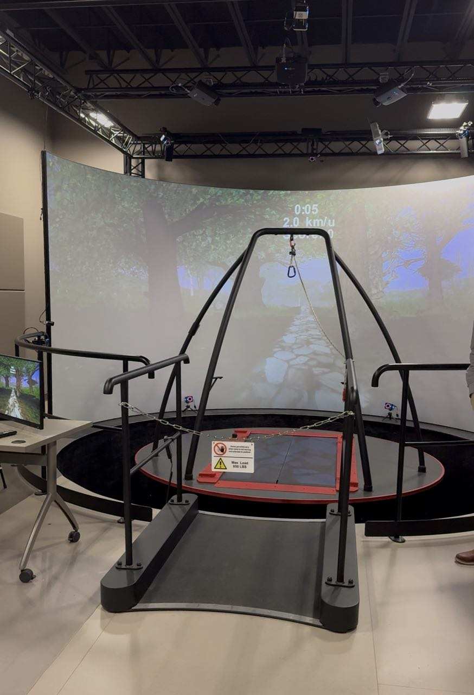
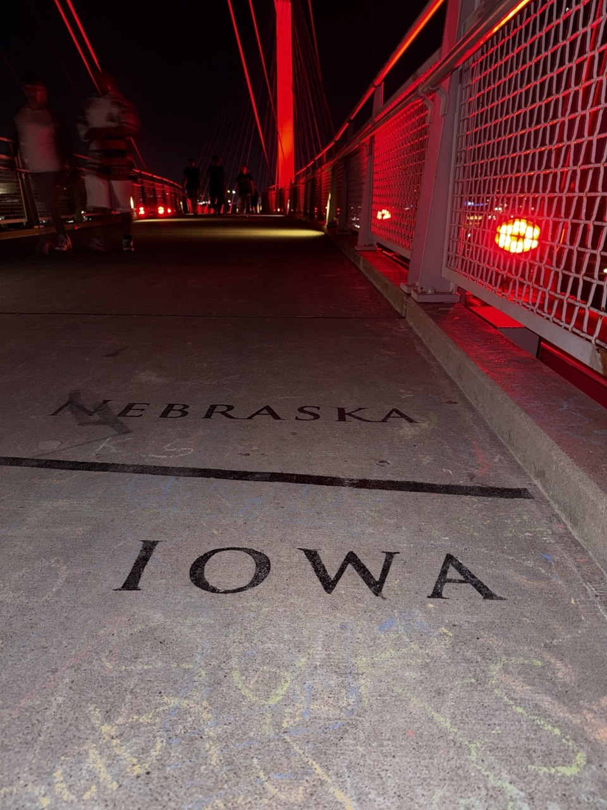

Last week, I had the chance to attend the **Human Movement Variability Conference 2026 (HMVC)** in Omaha, NE — an incredible gathering of biomechanics researchers. HMVC brings together scientists and clinicians focused on understanding variability in human movement and its implications for health, rehabilitation, and performance.

It was a great opportunity to present our work on **wearable haptic feedback systems for gait training** and to engage in discussions with leading experts about their latest advances in the field.

Alongside the conference, we had the chance to tour the state-of-the-art facilities at the **University of Nebraska at Omaha, Department of Biomechanics**, which are among the best in the US. The lab features advanced equipment including a six-degree-of-freedom treadmill with an immersive virtual reality environment for movement analysis research.

