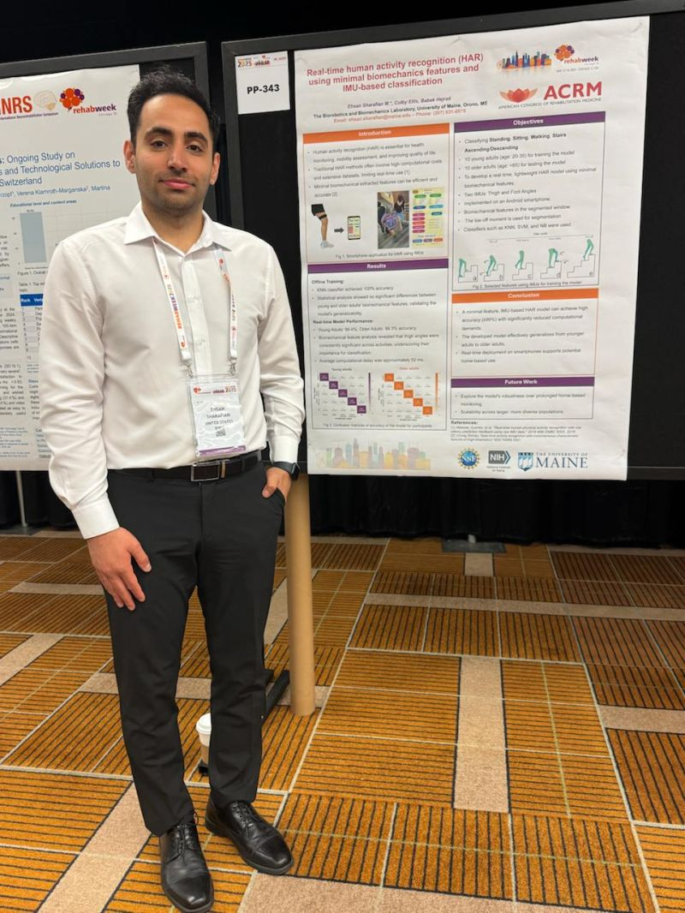
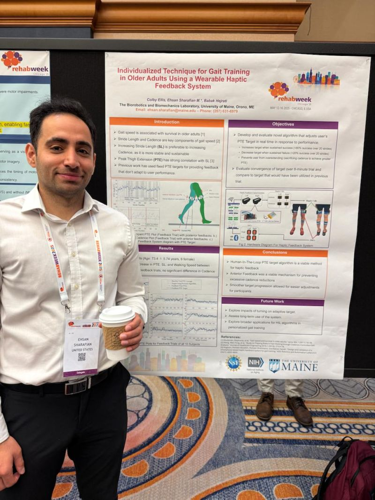
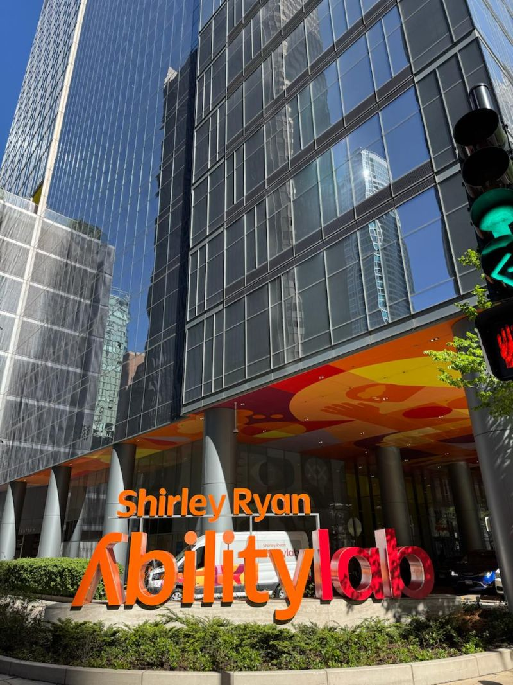

What an incredible week in **Chicago** — stunning architecture along the river and an inspiring program at **RehabWeek 2025**, one of the largest international gatherings in rehabilitation technology.

I was honored to present two posters from our group at the University of Maine **Biorobotics and Biomechanics Lab**:

- **Real-Time Human Activity Recognition Using Minimal Biomechanical Features and IMU-Based Classification** — [read the paper]()
- **Individualized Gait Training for Older Adults Using a Wearable Haptic Feedback System** — [read the paper]()

A highlight of the trip was visiting the **Shirley Ryan AbilityLab** — their state-of-the-art facilities, teams, and research made a strong impression.

Sincere thanks to the RehabWeek 2025 organizers, session chairs, and the **American Congress of Rehabilitation Medicine (ACRM)** for such a valuable and inspiring event advancing rehabilitation science.