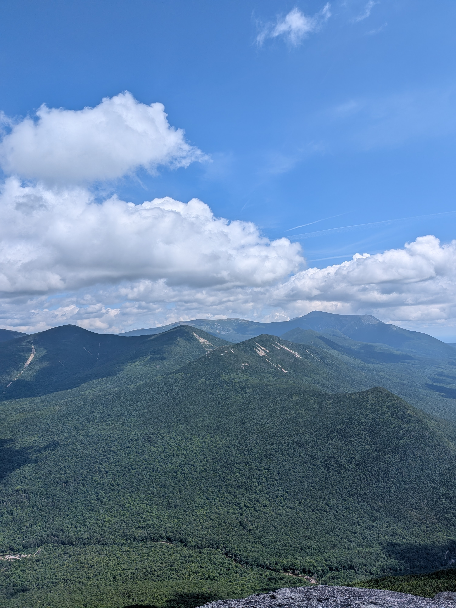
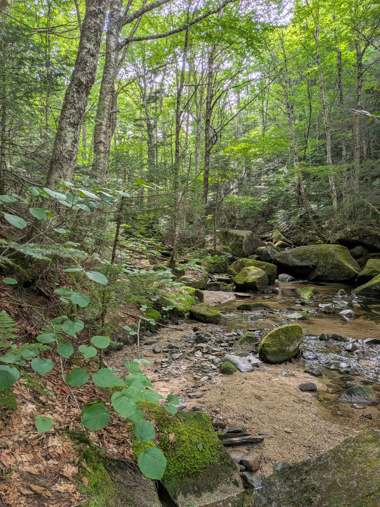
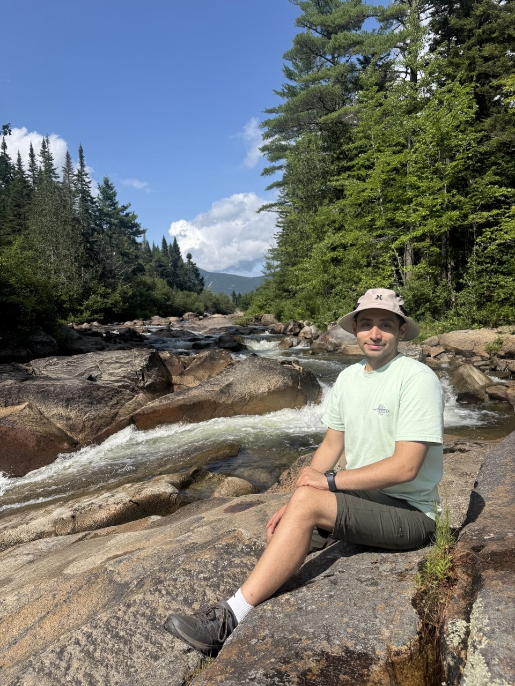
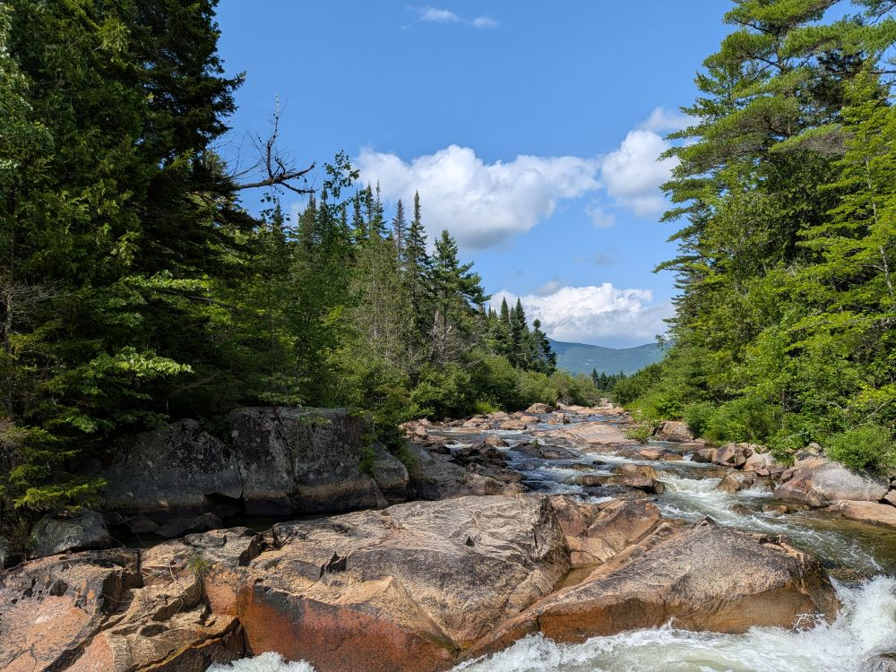
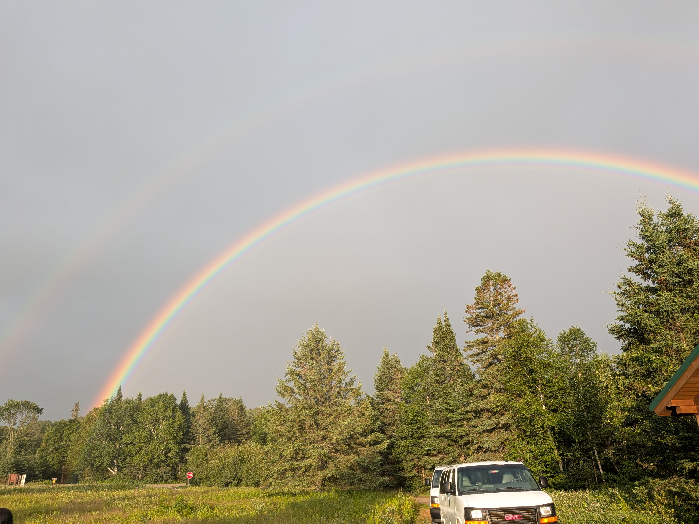

Some of the best reset buttons don't have a power button at all.

This summer, a group of us from UMaine packed up and disappeared into **Baxter State Park** for a weekend completely off the grid. No internet, no electricity, no notifications. Just good friends, big mountains, and the kind of quiet you only find deep in the Maine woods.

### Trip highlights

- 🥾 **Hiking Doubletop Mountain.** Steep, rocky, and completely worth it for the view at the top.
- 🛶 **Canoeing** on still, mirror flat water.
- 🔥 **Grilling saffron jooje kabob** over the fire, a little taste of home in the middle of the wilderness.
- 🌈 A surprise double rainbow over camp to send us off.

The hike in followed a mossy stream through the trees, cool and green and completely silent.

It opened up onto granite ledges and rushing water, the perfect place to stop, soak our feet, and catch our breath.

And then, right as we started packing up to head home, the sky decided to put on one last show.

### Watch the vlog

I put together a short video of the whole weekend. Take a look:



Highly recommend Baxter State Park for a summer adventure. Sometimes the best way to recharge is to fully unplug.
