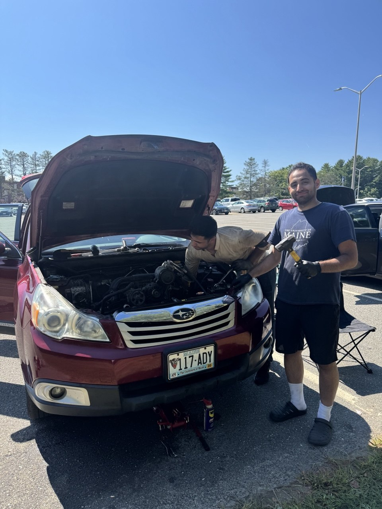
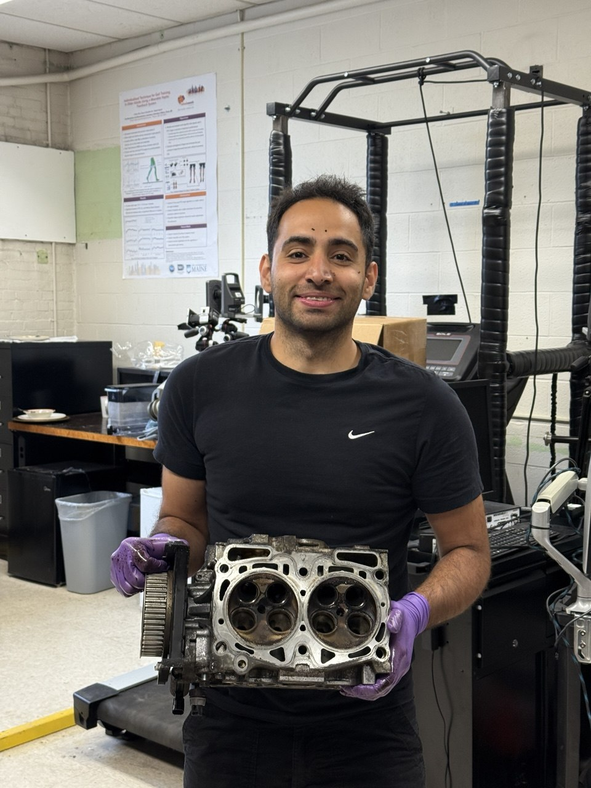
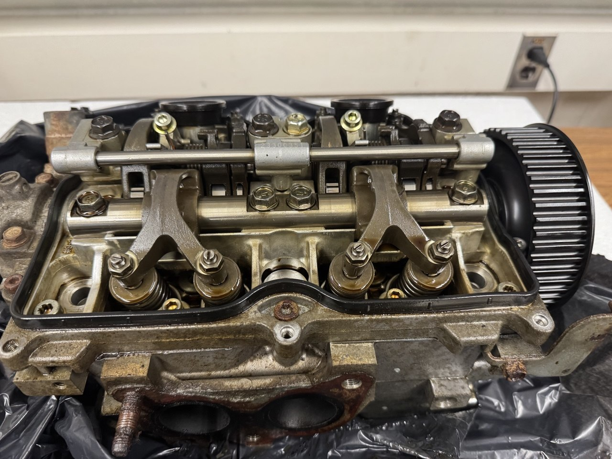
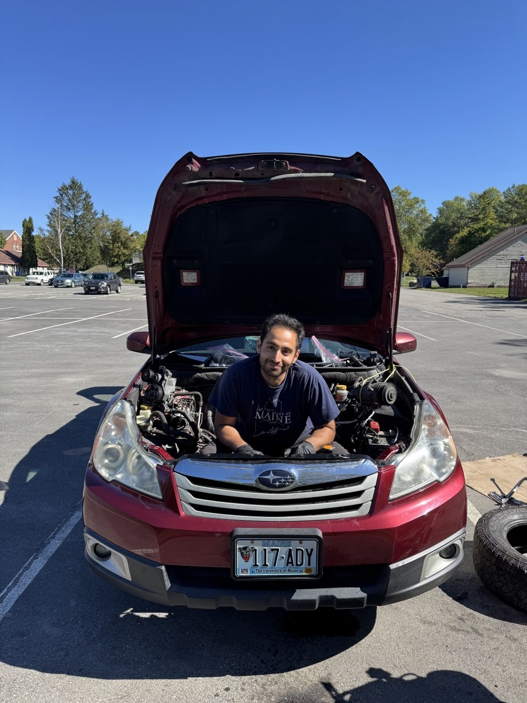
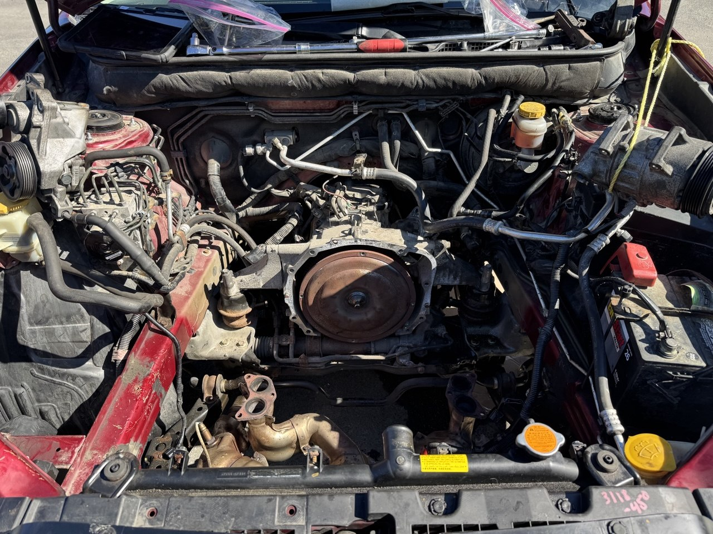
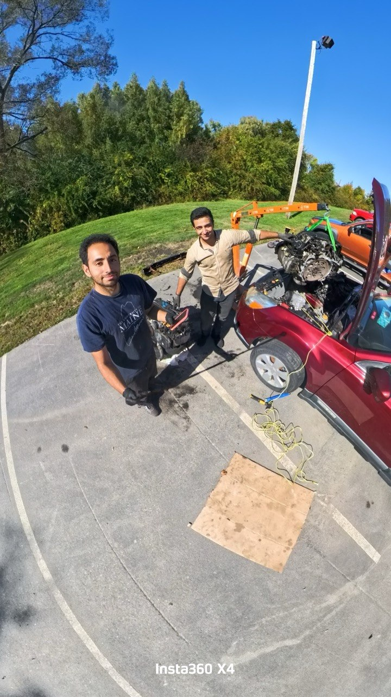
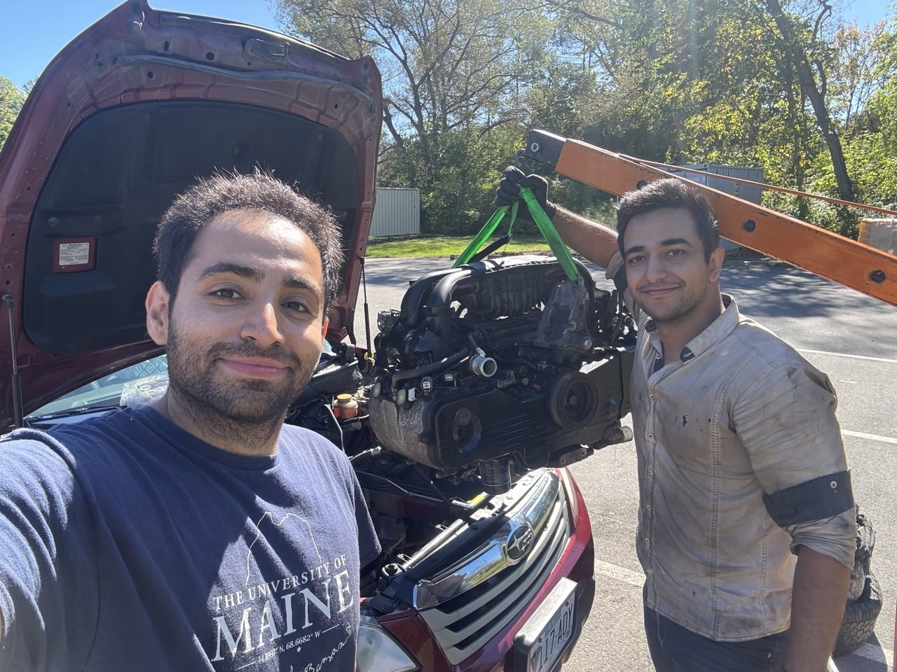

Some weekends you recharge in the mountains. Others you spend covered in oil in a parking lot, and honestly, those are just as good.

My Subaru Outback had been fighting me for a while, so one weekend we set up shop in the parking lot and got to work.

We started out hoping for a modest fix, replacing the valves and valve guides on the original engine to bring it back to life. I pulled the cylinder heads and we went through the valvetrain piece by piece.

But the old engine had other plans. After a lot of work it became clear it was simply done. So we did what any stubborn mechanical engineer would do. We pulled the whole thing and swapped in a fresh engine.

Out with the old, up on the hoist and out of the car.

I did this alongside my great friend and master wrench, and what could have been a frustrating repair turned into one of my favorite weekends of the semester. Engine hoist, hand tools, a cylinder head on the bench, and a lot of laughs. There is something deeply satisfying about understanding a machine well enough to take its heart out and give it a new one.

### A clip from the swap

  <video controls preload="metadata" playsinline style="width:100%;height:auto;border-radius:12px;box-shadow:0 6px 24px rgba(0,0,0,.15);">
    <source src="engine-swap-clip.mp4" type="video/mp4">
    Your browser does not support the video tag.
  </video>

### Watch the full vlog

We filmed the whole weekend. Here is the story from start to finish:



New engine in, hood closed, and back on the road. Not a bad way to spend a weekend outside the lab.
