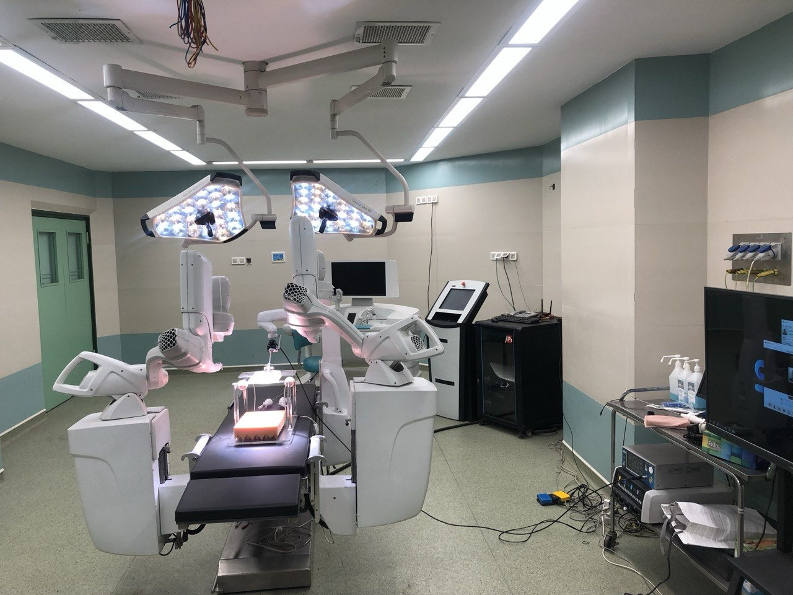
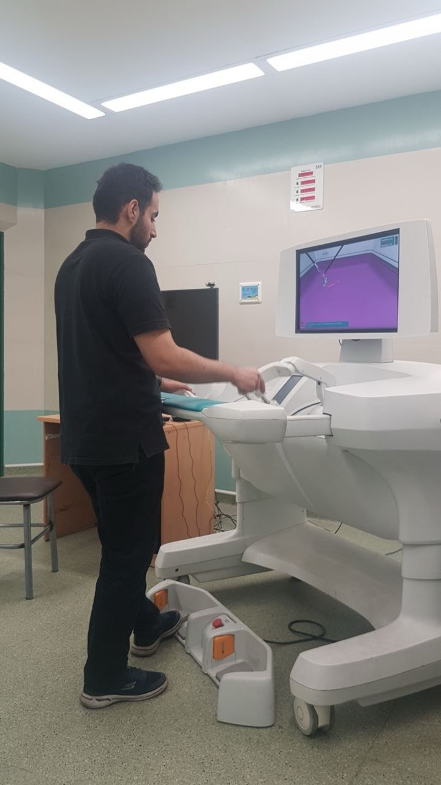
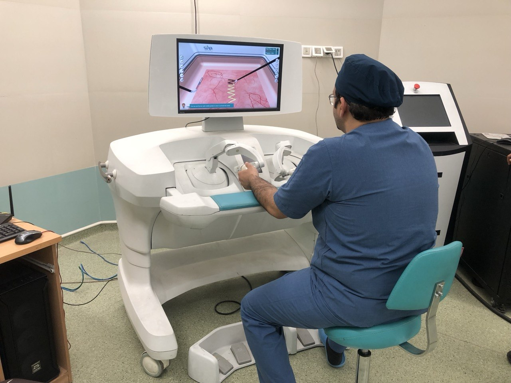
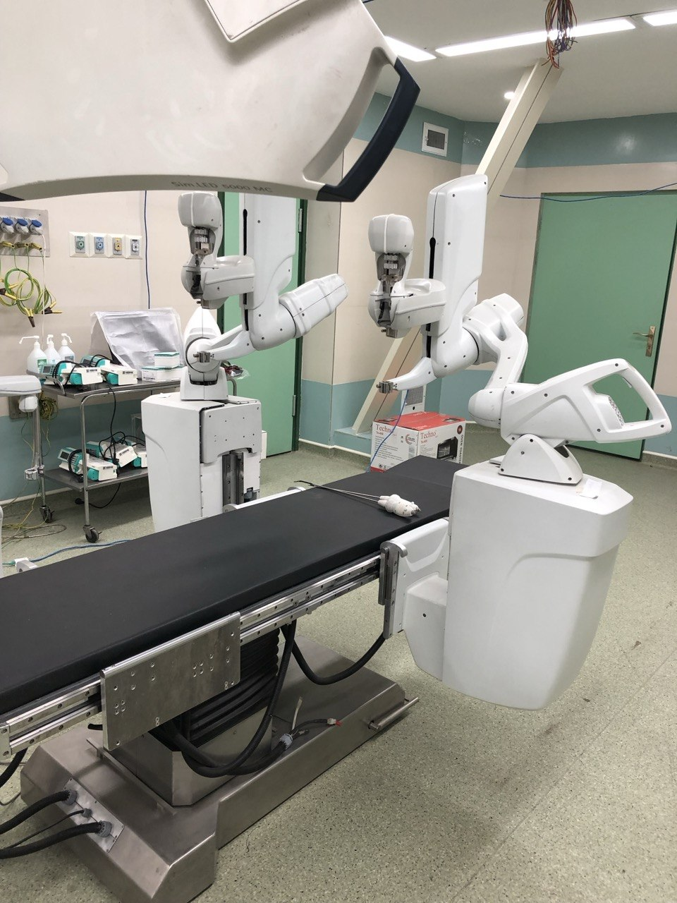

During my time at [Sina Robotics and Medical Innovators](https://sinamed.ir/), I worked as a Mechanical and Control Systems Engineer on an advanced robotic platform for minimally invasive laparoscopic surgery. My work focused on real-time control, inverse kinematics, and the surgeon-robot interface.

<!--more-->

## The System

The platform is a multi-degree-of-freedom surgical robot with dual manipulator arms, a surgeon console, and a training simulator for laparoscopic procedures.

## Control & Kinematics

I developed real-time control systems for the robotic arms using TwinCAT 3 (Beckhoff) and implemented inverse kinematics algorithms enabling precise, coordinated motion for surgical tasks. I also built Python-based graphical interfaces for intuitive surgeon-robot interaction.

## Surgeon Training

Beyond engineering, I trained surgeons and medical students on operating the robot, safety protocols, and clinical best practices using the simulation platform.

## Technical Stack

**TwinCAT 3 · Python · MATLAB · Real-time Control Systems · Inverse Kinematics · Laparoscopic Robotics**