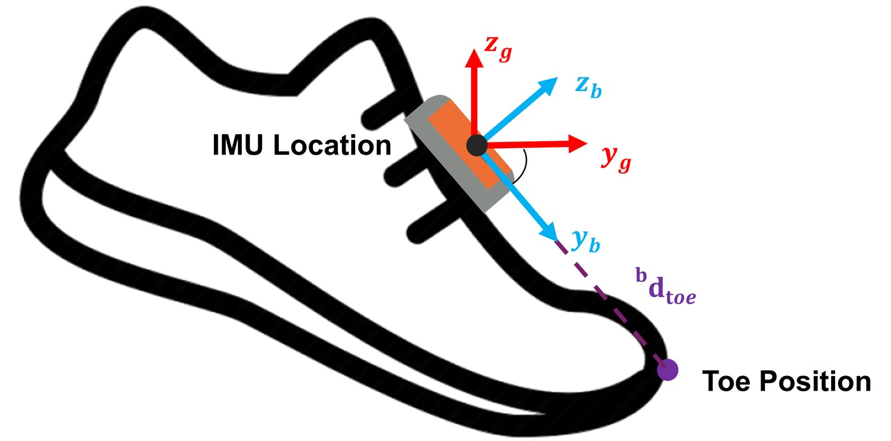
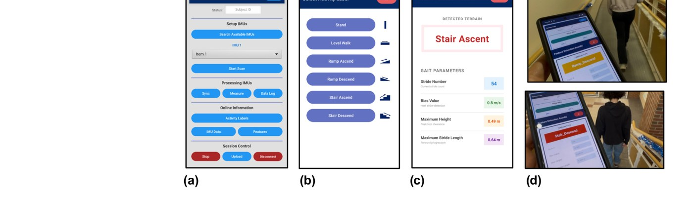
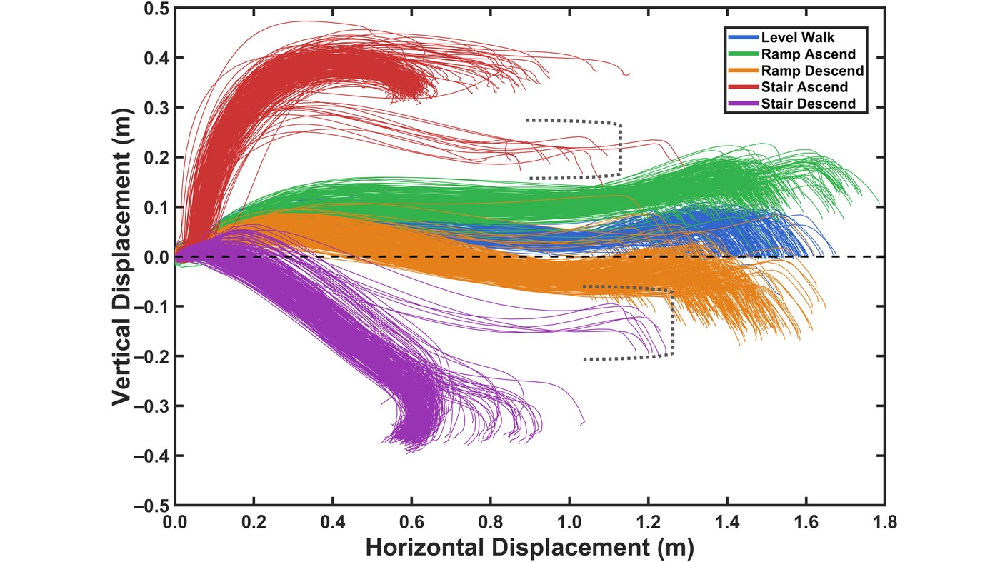
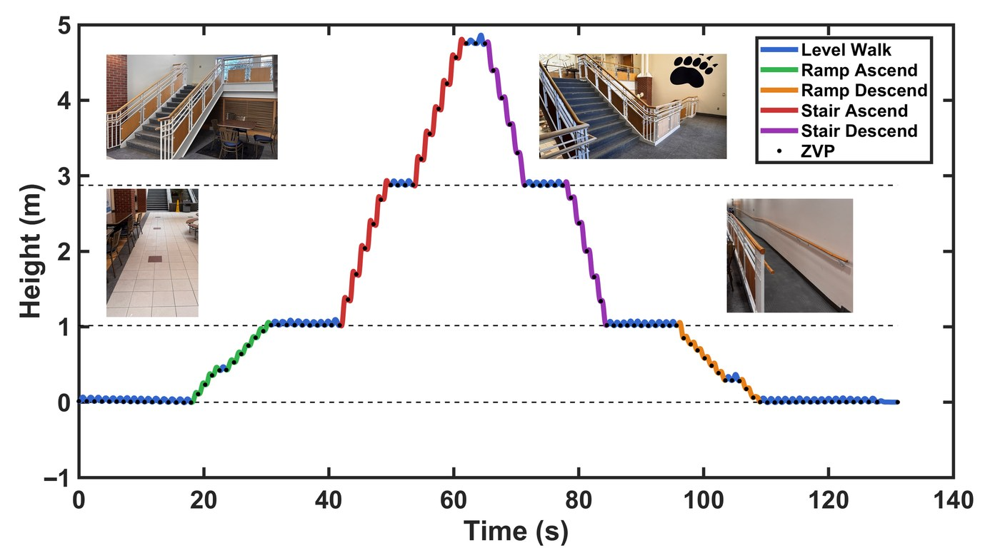
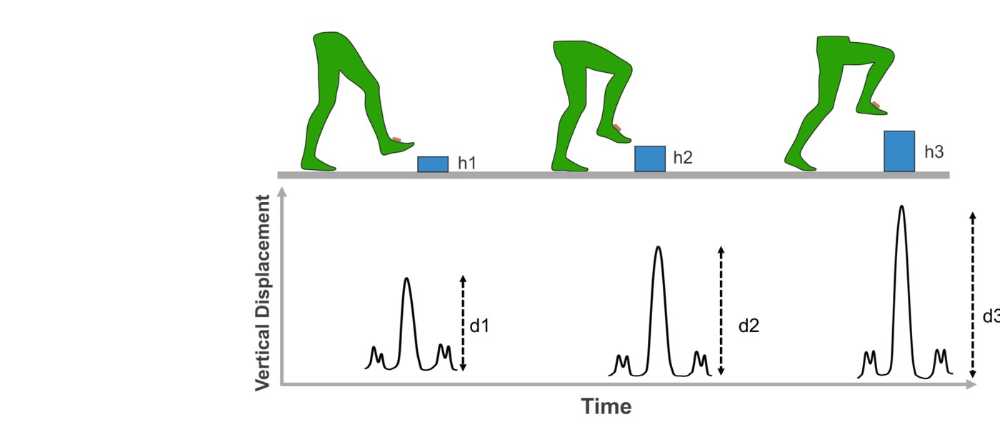

## Why it matters

Tripping is a leading cause of falls, and it is closely tied to how high we lift our feet while walking. Measuring **foot clearance** continuously, out in daily life, could flag fall risk early — but doing it well with a wearable sensor is hard:

- A single inertial measurement unit (IMU) drifts, so integrated foot height accumulates error over time.
- The usual fix (zero-velocity updates) does not fully remove **vertical** drift.
- More accurate methods work only **offline** and do not tell you what activity the person is doing.

## What I built

A **real-time, single-IMU system that runs entirely on a smartphone** — no cloud, no multi-sensor setup. It reconstructs the foot's height trajectory stride by stride *and* classifies five locomotion activities (level walking, ramp ascent/descent, stair ascent/descent) at the same time.

Key contributions:

- **On-device Android app** for stride-by-stride foot-clearance measurement and live activity classification.
- **Zero Height Change (ZHC) constraint** — a biomechanically grounded correction that cancels cumulative vertical drift at each stride boundary.
- **Heel-strike velocity error** used as a compact, physically meaningful feature to adaptively pick the right reconstruction model per activity.
- **Toe-height estimation** from the IMU pose through a rigid-body transformation, with accuracy comparable to the foot itself.

## Validating the height measurement

The reconstructed foot trajectories separate cleanly by activity, and the continuous height signal tracks real-world ramps and stairs across a full walking circuit.

To confirm the system measures real clearance, participants stepped over boxes of known heights and the estimated peak stride height was checked against each obstacle.

## Results

- **96.08%** overall activity-classification accuracy, with **less than one gait cycle** of latency.
- Level walking stayed at the ground reference (**0.0 cm**, 95% CI −1.8 to 1.8 cm).
- Cumulative height error stayed **below 1.1 cm** across ramp and stair negotiation (mean absolute error **0.42%**).
- Toe height was recovered with accuracy comparable to foot height.

Together, this gives a practical foundation for **real-time gait feedback and fall-prevention** tools that could one day run on the phone already in someone's pocket.