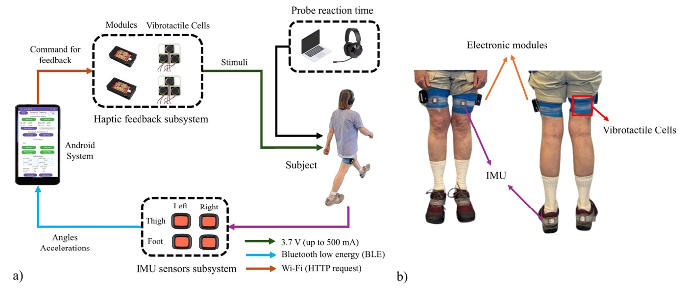
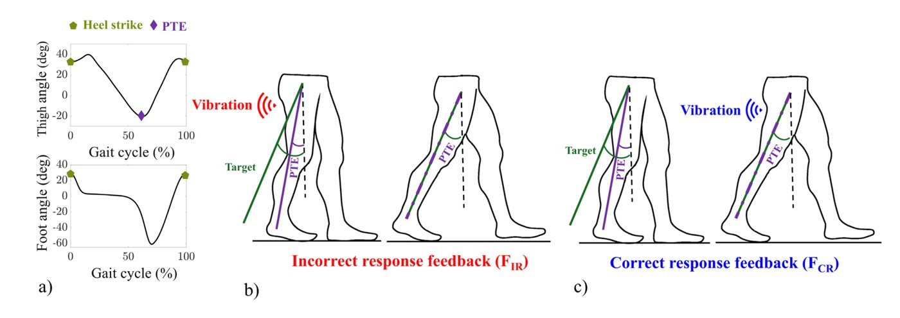
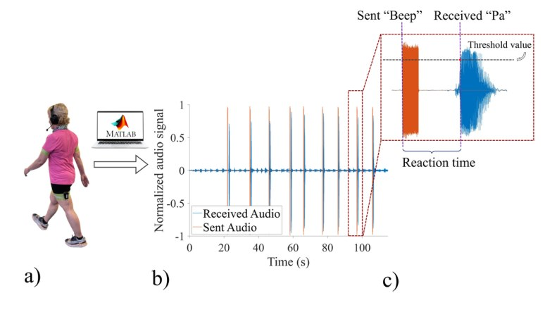
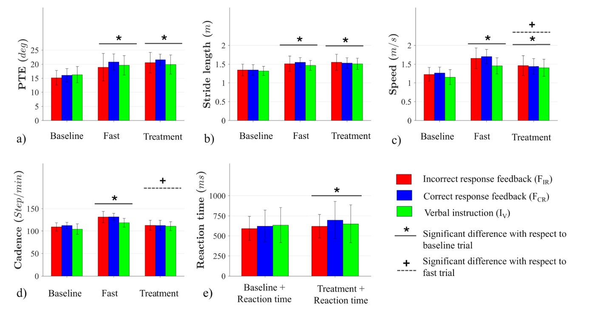

## Why it matters

Walking speed is one of the strongest predictors of health and independence in later life, and when it drops the cause is often **neuromotor**, the timing and coordination of movement, rather than weakness or poor fitness. A key culprit is reduced **peak thigh extension (PTE)**, how far the thigh swings back at the end of each step. If we could cue people to extend the thigh a little more, in real time and out in the world, we could lengthen their stride and speed them up, without a treadmill, a therapist, or a lab.

## What I built

A **wearable, smartphone-based haptic feedback system**. Two IMUs track the thigh and foot angles, the phone computes PTE stride by stride, and small **vibrotactile cells on the thighs** deliver a gentle cue when a step needs adjusting.

How the feedback works:

- Each stride's **PTE is compared to a personalized target**.
- Two feedback strategies were tested: a cue when the step was **incorrect** (PTE below target, F_IR) and a cue when the step was **correct** (target met, F_CR).
- A third group received only **verbal instructions** (I_V), as a benchmark for the haptic system.

## Measuring the mental cost

Any gait cue is only useful if people can follow it without concentrating so hard that they stop paying attention to their surroundings. To measure that **cognitive load**, participants did a probe reaction-time task while walking, responding to audio beeps, with reaction time measured precisely from the sent and received audio.

## Results

- **+14% stride length** and **+18% gait speed** from a single session with the haptic system.
- Gains were **comparable to verbal coaching**, but reached through a different mechanism (direct thigh feedback rather than instruction).
- Added cognitive load was **small**: reaction time rose only **27 ms (F_IR)** to **74 ms (F_CR)**.
- Thirty community-dwelling older adults, averaging about **80 years old**.

Together this shows that real-time thigh haptics can meaningfully improve older-adult gait in a single session while keeping attentional demand low, a promising, low-cost path toward wearable gait training and fall prevention.