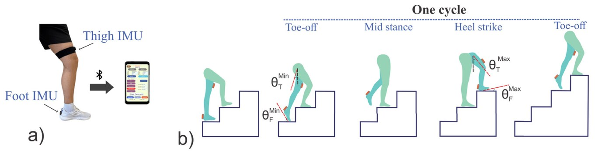
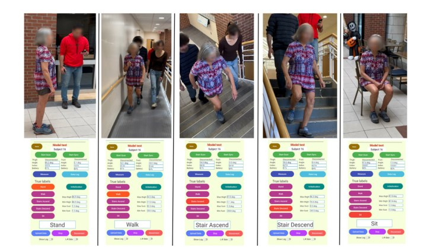
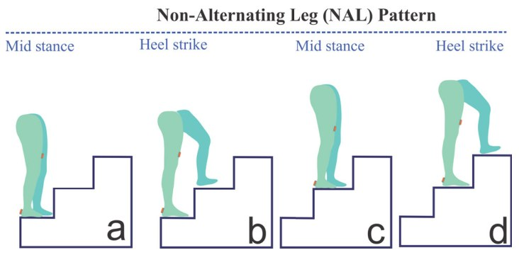
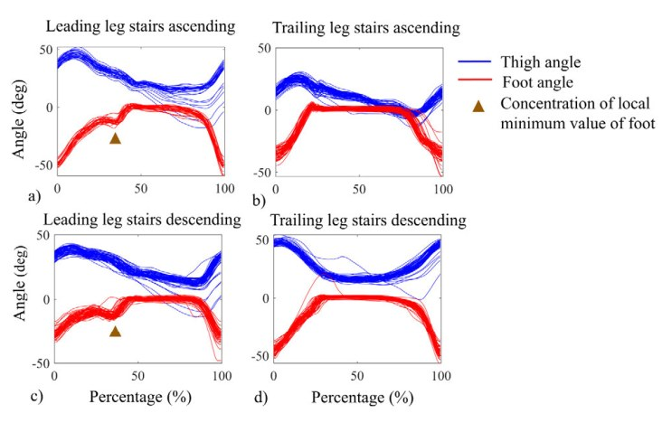

## Why it matters

Knowing what activity a person is doing, and how well they are doing it, is the foundation of any real-world health-monitoring tool. But most activity-recognition systems fall short where it matters most:

- They lean on **deep learning and large datasets**, so they are too heavy to run in real time on a phone.
- They are trained almost entirely on **young, healthy adults**, and quietly assume everyone moves the same way.
- Older adults with mobility limits often negotiate stairs with a **non-alternating leg (NAL)** pattern, leading with the same leg every step, and generic models simply misread this as normal.

## What I built

A **real-time, smartphone-based classifier** that uses only two interpretable inputs, the **thigh angle and the foot angle** from two small IMUs, to recognize five everyday activities: walking, stair ascent, stair descent, standing, and sitting.

Key contributions:

- **Minimal biomechanical features.** Rather than a deep network, a simple and interpretable **physics based KNN model** classifies activity from just the thigh and foot angles, light enough to run live on a phone.
- **Adaptive toe-off segmentation.** A segmentation step detects toe-off across different activities to cut each stride cleanly and reduce computation.
- **On-device Android app** that collects labeled data and reports activity in real time.
- **Built for older adults.** The model is explicitly trained to recognize the non-alternating leg stair pattern that generic classifiers miss.

## See it in action

A short demo of the system running live: the phone screen shows the app classifying activities in real time while a participant walks and negotiates stairs.

  

    <iframe style="position:absolute;top:0;left:0;width:100%;height:100%;border:0;"
      src="https://www.youtube.com/embed/n6E6TadydAA"
      title="Real-time activity recognition live demo"
      loading="lazy"
      allow="accelerometer; autoplay; clipboard-write; encrypted-media; gyroscope; picture-in-picture; web-share"
      allowfullscreen></iframe>
  

## Recognizing how older adults move

The hard case is stairs. When someone leads with the same leg on every step, the leading and trailing legs trace very different angle patterns, so the system has to read each leg differently.

Separating the **leading** leg from the **trailing** leg in the foot and thigh angle traces is what lets the model distinguish this mobility-limited pattern from normal stair negotiation.

## Results

- **99%** activity-classification accuracy for young and older adults with normal movement patterns.
- **93%** accuracy in distinguishing non-alternating leg stair negotiation from normal stair negotiation in older adults.
- Runs in **real time on a smartphone**, with no deep-learning model and no cloud.
- Validated on cohorts the model never trained on, including **ten older adults**.

Together this shows that a small set of well-chosen biomechanical features can power an accessible, real-time health-monitoring system that respects how aging populations actually move.